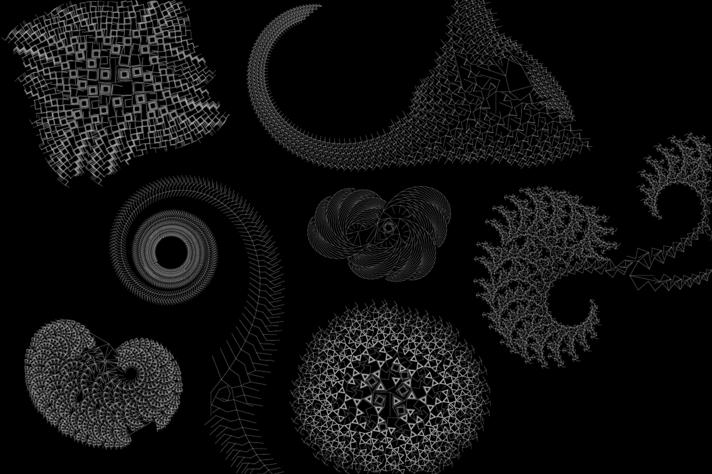

# ALifeLab



## Getting started
```shell
$ python3 -m venv venv # need only once

$ source venv/bin/activate

# Install
$ yarn install

# Build
$ yarn build

# Run
$ yarn start

# Test
$ yarn test

# Lint
$ yarn eslint
```

## Wallpaper


